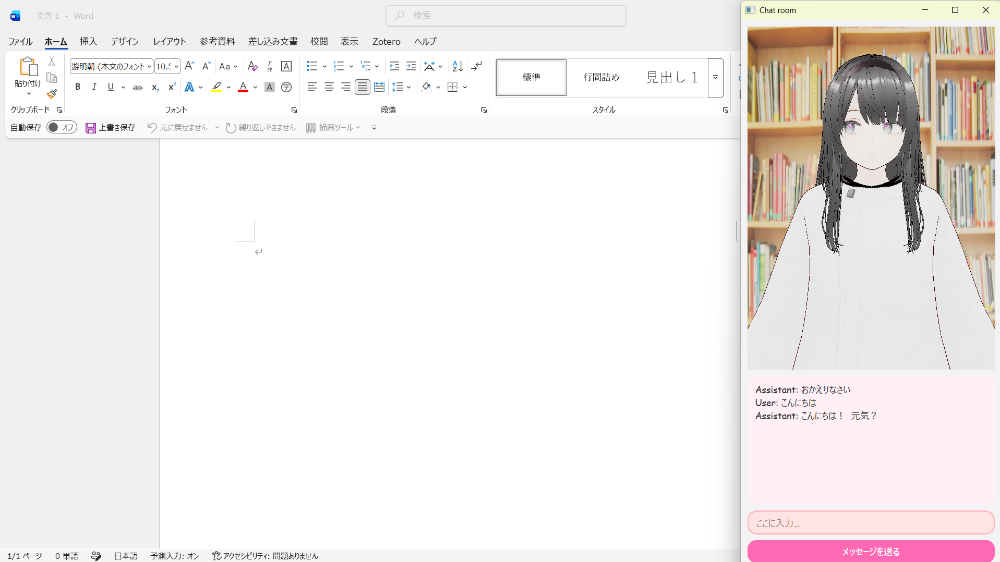

# AI Desktop Companion - ローカルLLM×VRM×音声合成によるデスクトップAIアシスタント

ローカル環境で完結する、3Dアバター（VRM）付きの対話型AIチャットアプリケーションです。
クラウドAPIに依存せず、LLM推論・音声合成をすべてローカルで実行する構成にすることで、
プライバシーを保ちながら低レイテンシな対話体験を実現しています。

## デモ



## 特徴

- **完全ローカル動作**：LLM推論（Ollama）・音声合成（VOICEVOX）を外部APIに依存せず実行し、API利用料やネットワーク遅延の懸念がない
- **ストリーミング応答による低遅延**：LLMの出力をトークン単位で受け取り、最初の一文が完成した時点ですぐ音声合成・再生を開始することで、体感的な応答速度を向上
- **3Dアバターとの同期演出**：Three.js + VRMで3Dキャラクターを描画し、音声再生に合わせたリップシンク・まばたき・視線追従などのアニメーションをリアルタイムに制御
- **Python ⇔ JavaScript間の双方向連携**：Qt WebChannelを用いて、デスクトップアプリ（PySide6）とWebフロントエンド（Three.js）間でシグナル・スロットベースの通信を実装

## 技術スタック

| 分類 | 使用技術 |
|---|---|
| デスクトップUI | Python, PySide6 (Qt) |
| LLM推論 | Ollama（ローカルLLM実行環境） |
| 音声合成 (TTS) | VOICEVOX |
| 3D描画 | Three.js, @pixiv/three-vrm |
| Python⇔JS連携 | Qt WebChannel, QWebEngineView |
| 音声入出力 | sounddevice, soundfile |

## システム構成

```
┌─────────────────────────────────────────────┐
│               PySide6 デスクトップアプリ         │
│                                               │
│  ┌───────────┐   WebChannel   ┌────────────┐  │
│  │  Python    │◄──────────────►│ QWebEngine │  │
│  │  (Bridge)  │                │  (Three.js)│  │
│  └─────┬──────┘                └─────┬──────┘  │
│        │                             │         │
└────────┼─────────────────────────────┼─────────┘
         │                             │
   ┌─────▼─────┐                 VRMモデル描画
   │  Ollama   │                 リップシンク
   │ (LLM推論) │                 表情制御
   └───────────┘
         │
   ┌─────▼─────┐
   │ VOICEVOX  │
   │ (音声合成) │
   └───────────┘
```

### 処理の流れ

1. ユーザーがチャット欄にメッセージを入力
2. PythonがOllamaへストリーミングでリクエストを送信し、LLMの応答をトークン単位で受信
3. 文の区切り（句点）を検出するたびにVOICEVOXへ音声合成をリクエストし、順次再生
4. 音声の再生開始・終了をQt WebChannel経由でJavaScript側に通知
5. JavaScript側がその通知を受けて、VRMアバターのリップシンク・表情アニメーションを制御

## 工夫した点・技術的課題

- **音声再生の遅延解消**：`sounddevice`の再生関数を毎回呼び出す実装では、ストリームの開閉コストにより数秒単位の遅延が発生していた。出力ストリームをアプリ起動時に一度だけ開いて使い回す方式に変更し、遅延を大幅に削減
- **ストリーミング応答と音声合成の並行処理**：LLMの全文生成を待たず、文単位で音声合成・再生を開始することで体感速度を改善。スレッドとロックを用いて、音声合成の処理と再生キューの排他制御を実装
- **キャラクターアニメーションの自然さ**：まばたきや視線追従、腕の揺れなどをランダム要素とサイン波で組み合わせ、静止時にも不自然に見えないよう調整

## セットアップ

### 必要な外部ソフトウェア

- [Ollama](https://ollama.com/)（ローカルLLM実行環境）
- [VOICEVOX](https://voicevox.hiroshiba.jp/)（音声合成エンジン）

### インストール

```bash
git clone https://github.com/misora2005/local-llm-vrm-companion.git
cd local-llm-vrm-companion
pip install -r requirements.txt
```

使用するLLMモデルを事前にpullしておいてください。

```bash
ollama pull <使用するモデル名>
```

### 起動

Ollama・VOICEVOXをそれぞれ起動したうえで、以下を実行します。

```bash
python app.py
```


### 背景画像について

著作権の都合上、背景画像(background.png)は本リポジトリに含めていません。


## 今後の展望

- 音声合成の音量エンベロープに基づいたリップシンクの精度向上
- 会話履歴の永続化（現状はアプリ終了時にリセットされる）
- 対応LLM・TTSエンジンの切り替えをUIから可能にする


## ライセンス


MIT License

このプロジェクトは以下のOSSを利用しています。
- [Ollama](https://ollama.com/)
- [VOICEVOX](https://voicevox.hiroshiba.jp/)（利用規約・音声ライブラリごとの規約を別途ご確認ください）
- [Three.js](https://threejs.org/)（MIT License）
- [@pixiv/three-vrm](https://github.com/pixiv/three-vrm)（MIT License）
